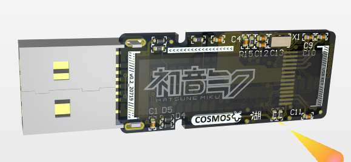

## COSMOS
COSMOS❀ is a usb key that can store your accounts and passwords safely.

It has an onboard 64MBit (8MB) NOR-FLASH and an stm32f030k6t6 mcu running under 48Mhz. Work with a ch9329 USB-HID chip, that can type your password and accounts automatically.

COSMOS❀ uses AES encryption to encrypt your data,
all your data are encrypted and stored in the nor flash.

## LICENSE
Licensed under MIT license with ❤.

## Credits
 - [ARM-software/CMSIS_5](https://github.com/ARM-software/CMSIS_5) The Common Microcontroller Software Interface Standard (CMSIS) is a vendor-independent abstraction layer for microcontrollers that are based on Arm Cortex processors.
 - [jnk0le/cortexm-AES](https://github.com/jnk0le/cortexm-AES) FIPS 197 compliant software AES implementation optimized for real world cortex-m microcontrollers.
